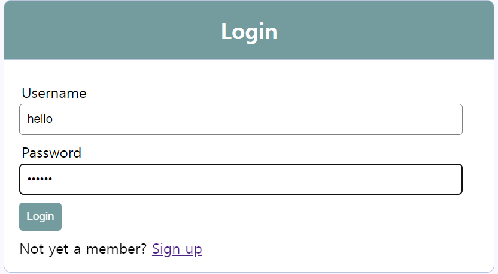
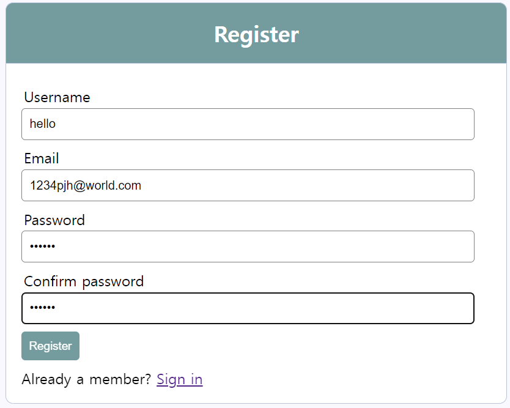
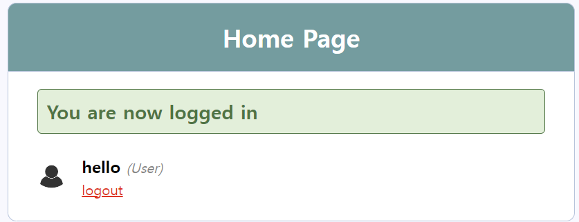
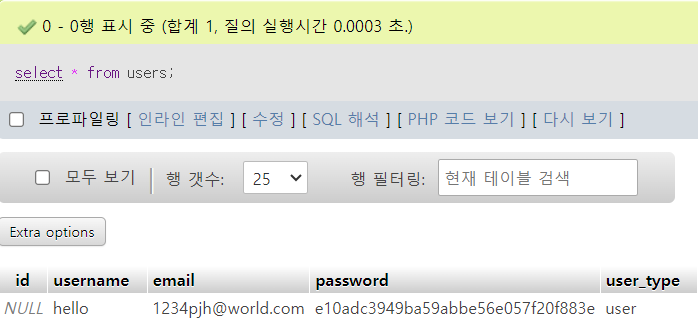

# ✅ Login DB 연동

## 1️⃣ 로그인 화면
  

> username / password를 입력하고 버튼을 누르면, fuctions.php에서 검사를 거치고, 일치되는 값이 있으면 로그인을 수행합니다.

## 2️⃣ 등록 화면
  

> register버튼이 눌리면 값들이 유효성 검사를 거친 후 DB에 값을 삽입하고 로그인 화면으로 돌아가게 되어있습니다.
  
## 3️⃣ 로그인 완료화면
  

## 🔡 Register 후 DB

> 등록 후에 users 테이블을 query 해보니 실제로 값이 들어갔다.

--------------------------------- 
## ❗functions.php 함수❗

### ▶️ login()

1. $_POST 배열에서 사용자명($username)과 비밀번호($password)를 가져옵니다.

2. 빈 필드 여부를 확인하고, 필드가 비어있는 경우 오류 메시지를 $errors 배열에 추가합니다.

3. 유효성 검사를 통과한 경우, 입력 받은 비밀번호를 MD5로 암호화합니다. 그리고 데이터베이스에서 해당 사용자명과 암호화된 비밀번호를 가진 사용자를 찾습니다.

4. 사용자가 존재하면, 해당 사용자의 정보를 가져오고 사용자 유형(user_type)을 확인합니다. 관리자일 경우 'admin/home.php'로, 일반 사용자일 경우 'index.php'로 리다이렉션하며, 세션에 사용자 정보를 저장합니다.

5. 사용자가 존재하지 않거나 비밀번호가 일치하지 않으면 오류 메시지를 $errors 배열에 추가합니다.

### ▶️ register()
  
1. 사용자 입력 수집: POST 방식으로 전송된 폼 데이터에서 사용자명($username), 이메일($email), 비밀번호($password_1, $password_2)를 수집합니다.
2. 폼 유효성 검사: 빈 필드 여부와 비밀번호 일치 여부를 확인하고, 문제가 있을 경우 오류 메시지를 $errors 배열에 추가합니다.
3. 사용자 등록: 유효성 검사를 통과한 경우, 사용자 정보를 데이터베이스에 등록합니다. 비밀번호는 MD5로 암호화되어 저장합니다.
4. 사용자 유형 처리: 선택적으로 사용자 유형($user_type)을 고려하여 데이터베이스에 삽입합니다. 유형이 지정되지 않은 경우 기본적으로 'user'로 설정됩니다.
5. 세션 설정: 사용자가 성공적으로 등록되면 세션에 사용자 정보를 저장하고, 성공 메시지를 설정합니다.
6. 페이지 리다이렉션: 마지막으로, 성공적으로 등록된 경우 'home.php' 또는 'index.php' 페이지로 리다이렉션합니다.

### ▶️ getUserById($id)
1. 매개변수: 함수는 사용자 ID를 매개변수로 받음
2. 쿼리 수행: 주어진 사용자 ID를 사용하여 users 테이블에서 해당 사용자의 정보를 선택하는 SQL 쿼리를 생성하고 실행합니다.
3. 결과 처리: 쿼리 실행 결과를 $result 변수에 저장하고, mysqli_fetch_assoc() 함수를 사용하여 결과 집합에서 한 행을 연관 배열로 가져옵니다. 이 연관 배열은 해당 사용자의 정보를 보여줍니다.
4. 사용자 정보 반환합니다.

### ▶️ e($val)
1. mysqli_real_escape_string() 함수를 사용하여 주어진 값에서 특수 문자를 이스케이프(escape)하여 SQL 쿼리에서 안전하게 사용할 수 있도록 합니다. 이 함수는 주로 사용자 입력 값을 데이터베이스에 삽입하기 전에 사용되어 SQL 인젝션을 방지한다고 합니다.
> 이스케이프된 값 반환

### ▶️ display_error()
1. 만약 $errors 배열에 오류 메시지가 하나 이상 들어있다면, 이를 HTML로 포맷하여 화면에 출력합니다.
2. 오류 메시지를 각각의 
 요소로 둘러싸고, 각 오류 메시지를 개행( )을 통해 분리하여 출력합니다. 이를 통해 각각의 오류 메시지가 시각적으로 구분되어 표시됩니다.

### ▶️ isLoggedIn()
> 이 코드는 사용자의 로그인 상태를 확인하고, 로그아웃 및 로그인 액션을 처리하는데 사용됩니다.
